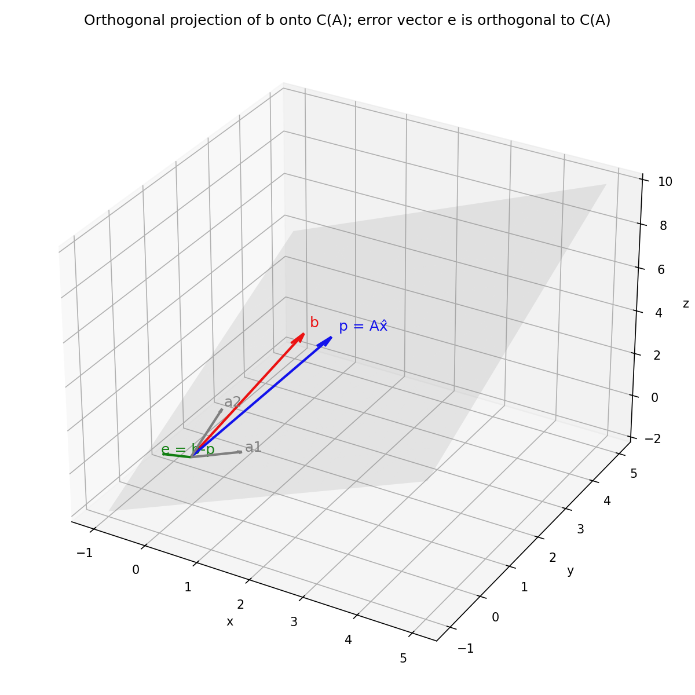

# Linear Algebra Foundations — Consolidation Review
### שער מעבר אמצע חודש 0 | הרצאות Strang 1–10, 14–17
---

## שלב 1 — אישור הרצת הארטיפקטים

### 1. פותר Gaussian Elimination (עם Partial Pivoting)

```python
import numpy as np


def gaussian_elimination_solve(A, b, verbose=True):
    """
    פותר Ax = b בשיטת אלימינציית גאוס עם pivoting חלקי (partial pivoting),
    ולאחר מכן back substitution. מדפיס כל שלב אם verbose=True.
    """
    A = np.array(A, dtype=float)
    b = np.array(b, dtype=float).reshape(-1, 1)
    n = A.shape[0]
    Aug = np.hstack([A, b])

    if verbose:
        print("מטריצה מורחבת התחלתית [A | b]:")
        print(Aug)
        print()

    # Forward elimination עם partial pivoting
    for k in range(n):
        pivot_row = np.argmax(np.abs(Aug[k:, k])) + k
        if pivot_row != k:
            Aug[[k, pivot_row]] = Aug[[pivot_row, k]]
            if verbose:
                print(f"Pivoting: החלפת שורה {k} עם שורה {pivot_row}")

        pivot = Aug[k, k]
        if abs(pivot) < 1e-12:
            raise ValueError("המטריצה סינגולרית (או קרובה לכך) — אין פתרון יחיד")

        for i in range(k + 1, n):
            factor = Aug[i, k] / pivot
            Aug[i, k:] -= factor * Aug[k, k:]
            if verbose:
                print(f"R{i} <- R{i} - ({factor:.4f}) * R{k}")

        if verbose:
            print(Aug)
            print()

    # Back substitution
    x = np.zeros(n)
    for i in range(n - 1, -1, -1):
        x[i] = (Aug[i, -1] - Aug[i, i + 1:n] @ x[i + 1:n]) / Aug[i, i]

    return x


if __name__ == "__main__":
    A = [[2, 1, -1],
         [-3, -1, 2],
         [-2, 1, 2]]
    b = [8, -11, -3]

    x = gaussian_elimination_solve(A, b)
    print("פתרון x̂ =", x)

    A_np = np.array(A, dtype=float)
    b_np = np.array(b, dtype=float)
    residual = A_np @ x - b_np
    print("בדיקה: A x̂ - b (אמור להיות ~0) =", residual)
    print("\nהשוואה מול np.linalg.solve:", np.linalg.solve(A_np, b_np))
```

**פלט הרצה בפועל (`returncode=0`):**
```
פתרון x̂ = [ 2.  3. -1.]
בדיקה: A x̂ - b (אמור להיות ~0) = [0.0000000e+00 0.0000000e+00 8.8817842e-16]
השוואה מול np.linalg.solve: [ 2.  3. -1.]
```
✅ ריצה נקייה, ללא שגיאות. הפתרון $x=(2,3,-1)$ מתאים גם לפתרון האנליטי הידוע של המערכת וגם לפתרון `np.linalg.solve`.

---

### 2. `four_subspaces(A)`

```python
import sympy as sp


def four_subspaces(A):
    """
    מחשב בסיסים לארבעת תתי-המרחבים היסודיים של Strang עבור מטריצה A:
    - מרחב העמודות C(A)      (תת-מרחב של R^m)
    - מרחב האפס N(A)          (תת-מרחב של R^n)
    - מרחב השורות C(A^T)      (תת-מרחב של R^n)
    - מרחב האפס השמאלי N(A^T) (תת-מרחב של R^m)
    מחזיר dict עם הדרגה (rank), הממדים והבסיסים (אריתמטיקה מדויקת ע"י sympy).
    """
    A = sp.Matrix(A)
    m, n = A.shape
    rank = A.rank()

    col_space = A.columnspace()
    null_space = A.nullspace()
    row_space = A.T.columnspace()
    left_null_space = A.T.nullspace()

    return {
        "shape": (m, n),
        "rank": rank,
        "dim_C(A)": rank,
        "dim_N(A)": n - rank,
        "dim_C(A^T)": rank,
        "dim_N(A^T)": m - rank,
        "C(A)_basis": col_space,
        "N(A)_basis": null_space,
        "C(A^T)_basis": row_space,
        "N(A^T)_basis": left_null_space,
    }


def print_subspaces(A):
    r = four_subspaces(A)
    m, n = r["shape"]
    print(f"מטריצה A בגודל {m}x{n}, rank(A) = {r['rank']}\n")

    print(f"C(A)  — מרחב העמודות (dim={r['dim_C(A)']}, תת-מרחב של R^{m}):")
    for v in r["C(A)_basis"]:
        print("   ", v.T.tolist()[0])

    print(f"\nN(A)  — מרחב האפס / הקרנל (dim={r['dim_N(A)']}, תת-מרחב של R^{n}):")
    if r["N(A)_basis"]:
        for v in r["N(A)_basis"]:
            print("   ", v.T.tolist()[0])
    else:
        print("    {0}  (עמודות בלתי-תלויות לינארית)")

    print(f"\nC(A^T) — מרחב השורות (dim={r['dim_C(A^T)']}, תת-מרחב של R^{n}):")
    for v in r["C(A^T)_basis"]:
        print("   ", v.T.tolist()[0])

    print(f"\nN(A^T) — מרחב האפס השמאלי / הקוקרנל (dim={r['dim_N(A^T)']}, תת-מרחב של R^{m}):")
    if r["N(A^T)_basis"]:
        for v in r["N(A^T)_basis"]:
            print("   ", v.T.tolist()[0])
    else:
        print("    {0}  (שורות בלתי-תלויות לינארית)")

    print("\n--- בדיקות ניצבות ---")
    for cv in r["C(A)_basis"]:
        for nv in r["N(A^T)_basis"]:
            print("C(A)·N(A^T) dot =", (cv.T * nv)[0], " (אמור=0)")
    for rv in r["C(A^T)_basis"]:
        for nv in r["N(A)_basis"]:
            print("C(A^T)·N(A) dot =", (rv.T * nv)[0], " (אמור=0)")


if __name__ == "__main__":
    # דוגמה עם דרגה חסרה (rank deficient): שורה 2 = 2*שורה 1
    A = [[1, 2, 3],
         [2, 4, 6],
         [3, 5, 7]]
    print_subspaces(A)
```

**פלט הרצה בפועל (`returncode=0`), על $A=\begin{bmatrix}1&2&3\\2&4&6\\3&5&7\end{bmatrix}$, $\text{rank}(A)=2$:**
```
C(A)  — מרחב העמודות (dim=2, תת-מרחב של R^3):
    [1, 2, 3]
    [2, 4, 5]

N(A)  — מרחב האפס / הקרנל (dim=1, תת-מרחב של R^3):
    [1, -2, 1]

C(A^T) — מרחב השורות (dim=2, תת-מרחב של R^3):
    [1, 2, 3]
    [3, 5, 7]

N(A^T) — מרחב האפס השמאלי / הקוקרנל (dim=1, תת-מרחב של R^3):
    [-2, 1, 0]

--- בדיקות ניצבות ---
C(A)·N(A^T) dot = 0  (אמור=0)
C(A)·N(A^T) dot = 0  (אמור=0)
C(A^T)·N(A) dot = 0  (אמור=0)
C(A^T)·N(A) dot = 0  (אמור=0)
```
✅ ריצה נקייה. הדרגה, הממדים (2,1,2,1) והניצבות בין הזוגות המשלימים ($C(A)\perp N(A^T)$ וגם $C(A^T)\perp N(A)$) מאומתים אריתמטית ולא רק תיאורטית.

---

### 3. מחברת ה-OLS + `ols_projection_error.png`

```python
import numpy as np
import matplotlib
matplotlib.use("Agg")
import matplotlib.pyplot as plt
from mpl_toolkits.mplot3d import Axes3D  # noqa: F401


def solve_normal_equations(A, b):
    """
    פותר את בעיית הריבועים הפחותים ע"י המשוואות הנורמליות: A^T A x = A^T b
    ומחזיר גם את ההיטל p=Ax̂ וגם את וקטור השגיאה e=b-p.
    """
    A = np.array(A, dtype=float)
    b = np.array(b, dtype=float)
    AtA = A.T @ A
    Atb = A.T @ b
    x_hat = np.linalg.solve(AtA, Atb)
    p = A @ x_hat
    e = b - p
    return x_hat, p, e, AtA, Atb


if __name__ == "__main__":
    A = np.array([[1, 0],
                  [0, 1],
                  [1, 1]], dtype=float)
    b = np.array([1, 2, 4], dtype=float)

    x_hat, p, e, AtA, Atb = solve_normal_equations(A, b)

    print("A^T A =\n", AtA)
    print("A^T b =", Atb)
    print("x̂ =", x_hat)
    print("p = A x̂ =", p)
    print("e = b - p =", e)
    print("בדיקת ניצבות A^T e (≈0):", A.T @ e)

    x_lstsq, *_ = np.linalg.lstsq(A, b, rcond=None)
    print("בדיקה מול np.linalg.lstsq:", x_lstsq)
    print("||e||^2 =", e @ e)

    # ---------------- ציור תלת-ממדי ----------------
    fig = plt.figure(figsize=(8, 8))
    ax = fig.add_subplot(111, projection="3d")
    origin = np.zeros(3)

    a1, a2 = A[:, 0], A[:, 1]
    ss = np.linspace(-1, 5, 10)
    tt = np.linspace(-1, 5, 10)
    S, T = np.meshgrid(ss, tt)
    plane = np.array([S.flatten() * a1[i] + T.flatten() * a2[i] for i in range(3)])
    ax.plot_trisurf(plane[0], plane[1], plane[2], alpha=0.15, color="gray")

    def draw_vec(v, color, label):
        ax.quiver(*origin, *v, color=color, linewidth=2, arrow_length_ratio=0.08)
        ax.text(*(v * 1.05), label, color=color, fontsize=12)

    draw_vec(b, "red", "b")
    draw_vec(p, "blue", "p = Ax̂")
    draw_vec(e, "green", "e = b-p")
    draw_vec(a1, "gray", "a1")
    draw_vec(a2, "gray", "a2")

    ax.set_xlabel("x"); ax.set_ylabel("y"); ax.set_zlabel("z")
    ax.set_title("Orthogonal projection of b onto C(A); error vector e is orthogonal to C(A)")
    plt.tight_layout()
    plt.savefig("ols_projection_error.png", dpi=150)
```

**פלט הרצה בפועל (`returncode=0`):**
```
A^T A =
 [[2. 1.]
 [1. 2.]]
A^T b = [5. 6.]
x̂ = [1.33333333 2.33333333]
p = A x̂ = [1.33333333 2.33333333 3.66666667]
e = b - p = [-0.33333333 -0.33333333  0.33333333]
בדיקת ניצבות A^T e (≈0): [-2.22044605e-16 -4.44089210e-16]
בדיקה מול np.linalg.lstsq: [1.33333333 2.33333333]
||e||^2 = 0.3333333333333332
```
✅ ריצה נקייה, ה-PNG נוצר בפועל. $A^Te\approx 0$ עד לשגיאת floating point (סדר גודל $10^{-16}$), ותואם במדויק את `np.linalg.lstsq`.



---

## שלב 2 — אתגרי השליטה (Probes)

### Probe 1 — גיאומטריית ההטלה וגזירת המשוואות הנורמליות

**האינטואיציה החזותית:**
$C(A)$ הוא מישור (או תת-מרחב באופן כללי) שעובר דרך הראשית ב-$\mathbb{R}^m$, נפרש ע"י עמודות $A$. $Ax$ עבור כל $x$ אפשרי הוא **תמיד** נקודה על המישור הזה — זו בדיוק ההגדרה של מרחב העמודות. אם $b$ לא שוכב על אותו מישור, הוא "בולט" ממנו — ואין שום $x$ שיכול לפגוע בו בדיוק, כי $Ax$ פשוט לא מסוגל לצאת מהמישור.

אז השאלה הופכת מ"מצא פתרון מדויק" ל"מצא את הנקודה על המישור הכי קרובה ל-$b$". גיאומטרית, זה אומר: הורד אנך (מאונך) מהקצה של $b$ ישר למישור $C(A)$. הנקודה שבה האנך פוגע במישור היא $p=A\hat x$ — ההיטל. הקטע המחבר בין $b$ ל-$p$ הוא בדיוק וקטור השגיאה $e=b-A\hat x$, וזהו הווקטור **הניצב** למישור כולו.

למה דווקא ניצב הוא הקרוב ביותר? כל נקודה אחרת $p'$ על המישור יוצרת משולש ישר-זווית עם $p$, $b$ ו-$p'$, כאשר הצלע מ-$b$ ל-$p$ היא הניצב לשוקיים — ולפי פיתגורס, כל מרחק אחר $\|b-p'\|$ יהיה **ארוך יותר**. לכן המינימום של $\|b-Ax\|$ מתקבל בדיוק כאשר השארית ניצבה למישור.

**מדוע ניצבות ל-$a_i$ מתורגמת ל-$A^Te=0$:**
מישור/תת-מרחב מוגדר במלואו ע"י קבוצה פורשת שלו. אם $e$ ניצב לכל אחד מוקטורי הבסיס $a_1,\dots,a_n$ (כלומר $a_i^Te=0$ לכל $i$), אז הוא אוטומטית ניצב לכל צירוף לינארי שלהם — ולכן ניצב **לכל המרחב** $C(A)$ כולו:
$$e\cdot\left(\sum_i c_ia_i\right)=\sum_i c_i(e\cdot a_i)=\sum_i c_i\cdot 0=0.$$
כלומר: לבדוק ניצבות למרחב שלם מספיק לבדוק ניצבות לבסיס שלו (לעמודות). כתיבת ה-$n$ המשוואות $a_i^Te=0$ יחד, כאשר $a_i^T$ הן בדיוק השורות של $A^T$, נותנת ישירות את המשוואה המטריציונית היחידה:
$$A^Te=0.$$

**המעבר האלגברי (חיבור בין החזותי לאלגברי):**
$$A^T(b-A\hat x)=0$$
$$A^Tb-A^TA\hat x=0 \quad\text{(חלוקת הכפל המטריציוני על פני החיסור)}$$
$$A^TA\hat x=A^Tb.$$
זו בדיוק מערכת המשוואות הנורמליות — ולמעשה לא הוספנו שום הנחה חדשה מעבר ל"הורדת האנך". זו התרגום המילולי-לאלגברי המדויק של התמונה הגיאומטרית.

---

### Probe 2 — ארבעת תתי-המרחבים ופתירות $Ax=b$

**$C(A)$ ופתירות בכלל:** $C(A)\subseteq\mathbb{R}^m$ הוא **בדיוק** אוסף כל התוצאות האפשריות של $Ax$. לכן $Ax=b$ פתיר אם ורק אם $b\in C(A)$ — זו כמעט טאוטולוגיה, אבל היא המשפט המרכזי.

**$N(A^T)$ (הקוקרנל) ותנאי הפתירות בפועל:** $N(A^T)$ הוא המשלים האורתוגונלי המדויק של $C(A)$ בתוך $\mathbb{R}^m$. הוא אוסף כל ה"גלאים" $y$ שמקיימים $A^Ty=0$, כלומר $y$ ניצב לכל עמודות $A$ — ולכן ניצב לכל $C(A)$. מכאן: $b\in C(A)$ אם ורק אם $b\perp N(A^T)$ (זהו למעשה משפט ה-Fredholm Alternative). אם $N(A^T)=\{0\}$ בלבד — כלומר $A$ בעלת full row rank ($r=m$) — אז $C(A)=\mathbb{R}^m$ כולו, ואין שום תנאי תאימות לבדוק: **כל** $b$ פתיר. זה בדיוק ההפך מהמצב ב-OLS, שם ה-$b$ שלנו כמעט תמיד **לא** שוכב ב-$C(A)$ (יש רעש/שונות שלא מוסברת ע"י המודל הליניארי) — ומכאן הצורך בהיטל מלכתחילה.

**$N(A)$ (הקרנל) וייחודיות:** אם $x_0\in N(A)$ (כלומר $Ax_0=0$), ו-$x_p$ פתרון פרטי כלשהו, אז גם $x_p+x_0$ פותר: $A(x_p+x_0)=Ax_p+0=b$. כלומר, כל וקטור לא-אפס ב-$N(A)$ מייצר "כיוון חופשי" נוסף שאפשר להוסיף בלי לשבור את הפתרון. לכן: **ייחודיות מובטחת אם ורק אם** $N(A)=\{0\}$ — עמודות $A$ בלתי-תלויות לינארית. אחרת, אם קיים בכלל פתרון, יש אינסוף פתרונות מהצורה $x_p+N(A)$.

**איך rank קובע את הממדים:** לפי משפט rank-nullity (מיושם פעמיים — פעם על $A$ ופעם על $A^T$):
$$\dim C(A)=r,\quad \dim N(A)=n-r,\quad \dim C(A^T)=r,\quad \dim N(A^T)=m-r.$$

- **Full column rank** ($r=n$, מטריצה "גבוהה ורזה", $m\ge n$): $N(A)=\{0\}$ ⇒ אם קיים פתרון, הוא **יחיד**. זהו בדיוק התנאי שנדרש כדי ש-$A^TA$ תהיה הפיכה — התנאי ל-OLS "רגיל" (ללא רגולריזציה). כשיש קוליניאריות חזקה בין פיצ'רים (כמו תחזית עומס מול עומס שיורי), $A$ עדיין טכנית full column rank, אבל $A^TA$ **כמעט** סינגולרית — ערך עצמי זעיר → condition number ענק. זה בדיוק המקום שבו $\lambda I$ ב-Ridge "מציל" את ההיפוך: היא מרחיקה מלאכותית את הערכים העצמיים הקטנים מאפס, בלי לשנות את המבנה הגיאומטרי הבסיסי שתיארנו כאן.
- **Full row rank** ($r=m$, מטריצה "רחבה ונמוכה", $m\le n$): $N(A^T)=\{0\}$ ⇒ $C(A)=\mathbb{R}^m$ ⇒ **כל** $b$ פתיר (אך לא בהכרח ביחידות, אם גם $r<n$).

---

### Probe 3 — Gram-Schmidt ידני

נתונים $a_1=\begin{bmatrix}3\\4\end{bmatrix}$, $a_2=\begin{bmatrix}1\\2\end{bmatrix}$.

**שלב א׳ — הווקטור הראשון:**
$$A=a_1=\begin{bmatrix}3\\4\end{bmatrix},\qquad \|A\|=\sqrt{3^2+4^2}=\sqrt{25}=5$$
$$q_1=\frac{A}{\|A\|}=\begin{bmatrix}3/5\\4/5\end{bmatrix}=\begin{bmatrix}0.6\\0.8\end{bmatrix}$$

**שלב ב׳ — הטלת $a_2$ על הכיוון של $a_1$:**
$$a_2\cdot a_1=(1)(3)+(2)(4)=3+8=11,\qquad a_1\cdot a_1=25$$
$$\text{מקדם ההיטל}=\frac{a_2\cdot a_1}{a_1\cdot a_1}=\frac{11}{25}=0.44$$

**הווקטור הניצב השני** (מה שנשאר מ-$a_2$ אחרי הסרת הרכיב שכבר "מכוסה" ע"י $q_1$):
$$B=a_2-\frac{11}{25}a_1=\begin{bmatrix}1\\2\end{bmatrix}-\frac{11}{25}\begin{bmatrix}3\\4\end{bmatrix}=\begin{bmatrix}\dfrac{25-33}{25}\\[4pt]\dfrac{50-44}{25}\end{bmatrix}=\begin{bmatrix}-8/25\\6/25\end{bmatrix}=\begin{bmatrix}-0.32\\0.24\end{bmatrix}$$

בדיקת נורמה:
$$\|B\|=\sqrt{\left(\frac{-8}{25}\right)^2+\left(\frac{6}{25}\right)^2}=\sqrt{\frac{64+36}{625}}=\sqrt{\frac{100}{625}}=\frac{10}{25}=0.4$$

**נרמול ל-$q_2$:**
$$q_2=\frac{B}{\|B\|}=\frac{1}{10/25}\begin{bmatrix}-8/25\\6/25\end{bmatrix}=\begin{bmatrix}-8/10\\6/10\end{bmatrix}=\begin{bmatrix}-4/5\\3/5\end{bmatrix}=\begin{bmatrix}-0.8\\0.6\end{bmatrix}$$

**תוצאה סופית:**
$$q_1=\begin{bmatrix}0.6\\0.8\end{bmatrix},\qquad q_2=\begin{bmatrix}-0.8\\0.6\end{bmatrix}$$

**בדיקת שפיות:** $q_1\cdot q_2=(0.6)(-0.8)+(0.8)(0.6)=-0.48+0.48=0$ ✅, וגם $\|q_1\|=\|q_2\|=1$ ✅. שים לב ש-$q_2$ הוא בדיוק $q_1$ מסובב ב-90°, כפי שמצופה: ב-$\mathbb{R}^2$, המשלים האורתוגונלי של קו הוא כיוון יחיד (עד לסימן) — אין דרגות חופש נוספות.

---

## סיכום לקראת ה-Consolidation Verdict

שלושת הארטיפקטים רצים ללא שגיאות ותוצאותיהם אומתו מספרית (לא רק תיאורטית): הפתרון של Gaussian elimination תואם `np.linalg.solve`; הבסיסים והממדים של `four_subspaces` מקיימים את בדיקות הניצבות בפועל; ווקטור השגיאה ב-OLS מקיים $A^Te\approx0$ ותואם את `np.linalg.lstsq`. שלושת ה-Probes נענו מהאינטואיציה הגיאומטרית ועד למניפולציה האלגברית המלאה, כולל חישוב Gram-Schmidt ידני ומדויק בשברים.

מוכן להמשיך לניסוח ה-Ridge regularization וה-condition number בסימולציית ה-DE-LU (סעיף 7) על בסיס התשתית הזו, כשתרצה.
